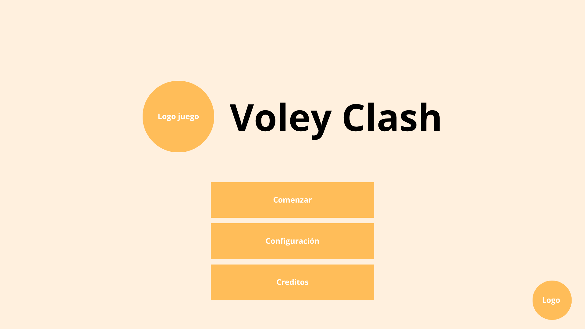
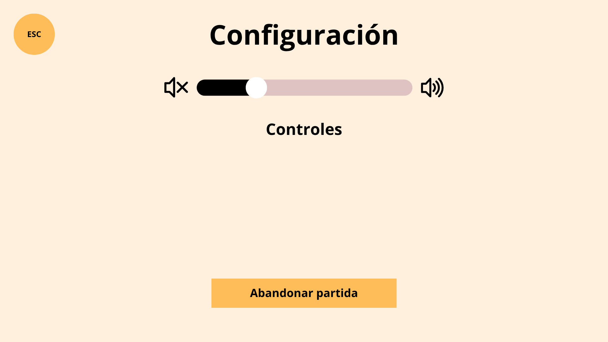
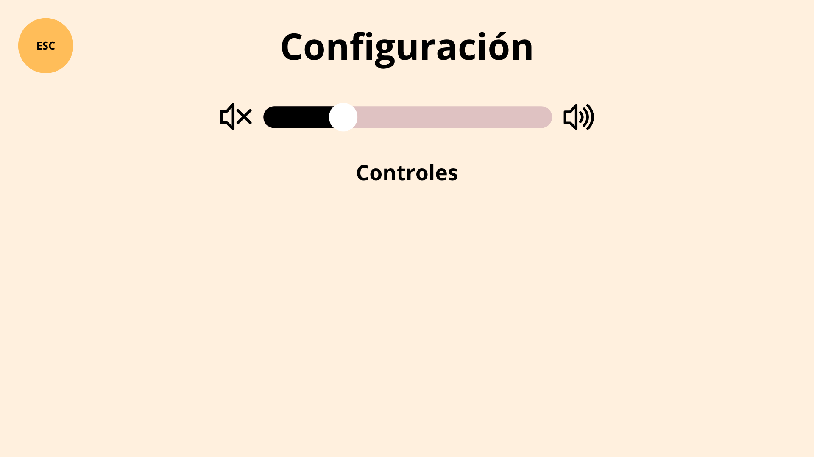
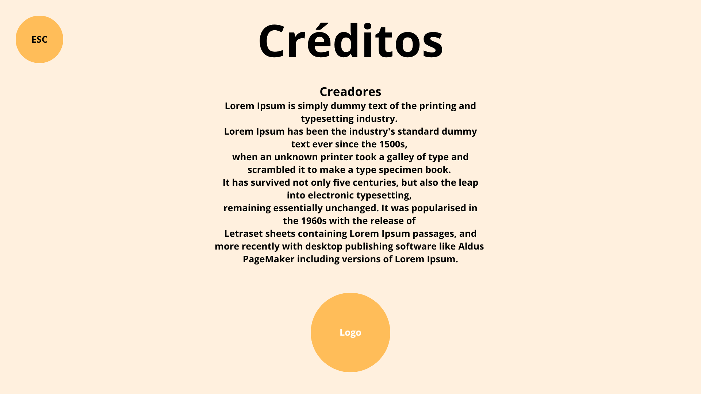
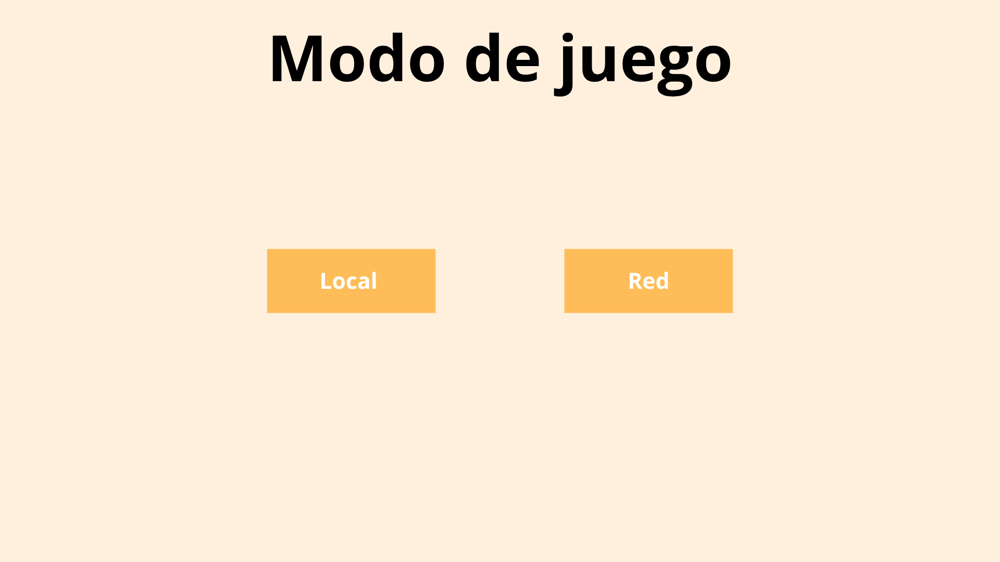
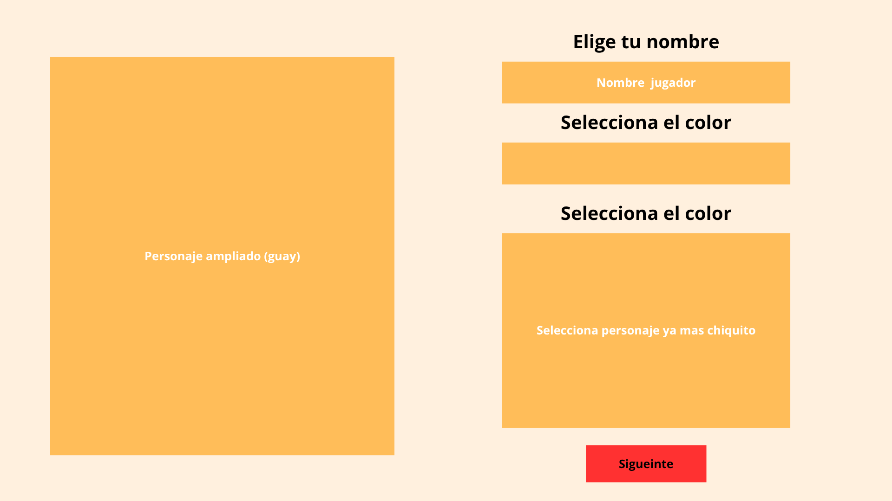
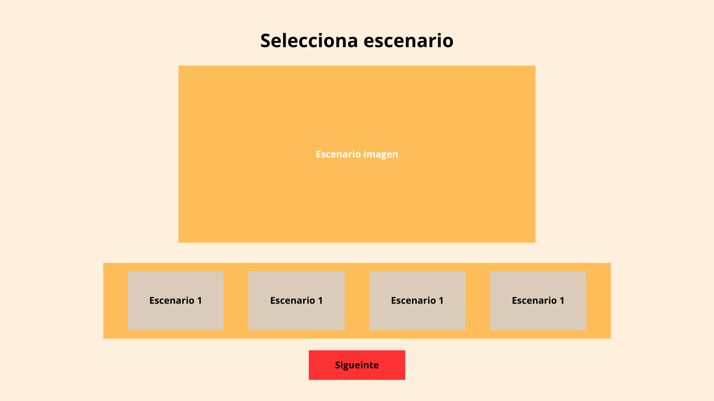
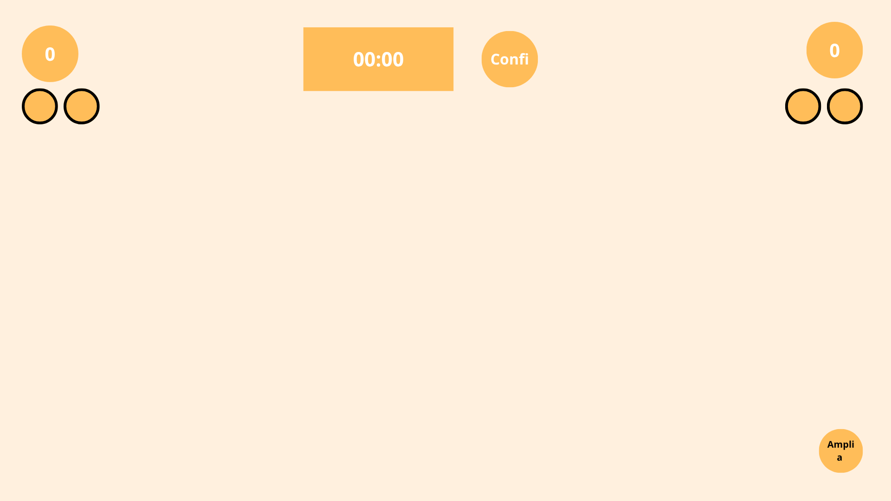
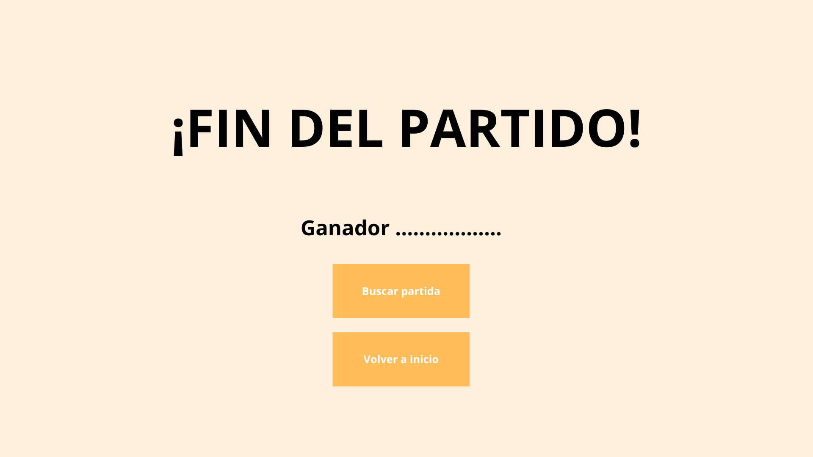
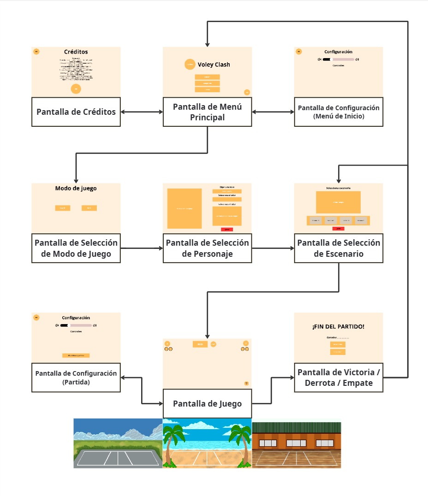

# Volley Clash
## Descripción de la Temática
**Volley Clash** es un juego multijugador de **voleibol arcade** en 2D desarrollado para navegador web.  En él, dos jugadores se enfrentan en partidos rápidos y competitivos, combinando **físicas realistas**, **power-ups aleatorios** y una estética **pixel-art minimalista**.  

El objetivo es derrotar al oponente alcanzando **11 puntos**, teniendo al menos 2 de ventaja para ganar el set, en un partido a **3 sets**, controlando el salto, golpeo y posición del personaje con una jugabilidad sencilla pero desafiante.  

## Información del Equipo

**Número de Grupo:** 5   
**Repositorio de GitHub:** [URL del repositorio](https://github.com/Minhxia/jer-volleyclash-sunsetarcade)  
**Equipo de Desarrollo:**

| Nombre | Correo Oficial | Cuenta de GitHub |
|--------------|--------------|--------------|
| Sara Bueno Esteban      | s.buenoe.2018@alumnos.urjc.es   | [GitHub - Minhxia](https://github.com/Minhxia)            |
| Antonio Morán Barrera   | a.moranb.2022@alumnos.urjc.es   | [GitHub - Splatboy32](https://github.com/Splatboy32)      |
| Cristine Nioka Tewo     | c.nioka.2022@alumnos.urjc.es    | [GitHub - cchrusta](https://github.com/cchrusta)          |
| Álvaro Ibáñez Montero   | a.ibanezm.2023@alumnos.urjc.es  | [GitHub - Alvaro-Ibanez](https://github.com/Alvaro-Ibanez)|

---

# Game Design Document: Volley Clash

## Índice

1. [Introducción](#1-introducción)  
 1.1 [Concepto del juego](#11-concepto-del-juego)  
 1.2 [Género](#12-género)  
 1.3 [Propósito y público objetivo](#13-propósito-y-público-objetivo)  
 1.4 [Plataforma](#14-plataforma)  
 1.5 [Categoría](#15-categoría)  
 1.6 [Alcance](#16-alcance)

2. [Características Principales](#2-características-principales)

3. [Aspectos Técnicos](#3-aspectos-técnicos)  
 3.1 [Lenguajes y Frameworks](#31-lenguajes-y-frameworks)  
 3.2 [Arquitectura Cliente-Servidor](#32-arquitectura-cliente-servidor)  
 3.3 [Control de Versiones y Gestión](#33-control-de-versiones-y-gestión)

4. [Jugabilidad](#4-jugabilidad)  
 4.1 [Objetivo del juego](#41-objetivo-del-juego)  
 4.2 [Controles](#42-controles)  
 4.3 [Mecánicas](#43-mecánicas)  
  4.3.1 [Movimiento](#431-movimiento)  
  4.3.2 [Interacción entre jugadores](#432-interacción-entre-jugadores)  
  4.3.3 [Físicas](#433-físicas)  
  4.3.4 [Dificultad progresiva](#434-dificultad-progresiva)  
  4.3.5 [Condiciones de victoria y derrota](#435-condiciones-de-victoria-y-derrota)  
 4.4 [Reglas del juego](#44-reglas-del-juego)  
 4.5 [Diagrama de Flujo](#45-diagrama-de-flujo)  

5. [Imagen y Diseño Visual](#5-imagen-y-diseño-visual)  
 5.1 [Estilo visual](#51-estilo-visual)  
 5.2 [Uso de colores](#52-uso-de-colores)  
 5.3 [Logotipo](#53-logotipo)  
 5.4 [Bocetos](#54-bocetos)  
  5.4.1 [Interfaces](#541-interfaces)  
  5.4.2 [Diagrama de Estados](#542-diagrama-de-estados)  
  5.4.3 [Personajes](#543-personajes)  
  5.4.4 [Escenarios](#544-escenarios)  
  5.4.5 [Elementos del juego](#545-elementos-del-juego)  

6. [Sonido](#6-sonido)  
 6.1 [Música](#61-música)  
 6.2 [Efectos de sonido](#62-efectos-de-sonido)

7. [Narrativa](#7-narrativa)  
 7.1 [Historia general del juego](#71-historia-general-del-juego)  
 7.2 [Desarrollo de personajes](#72-desarrollo-de-personajes)  
 7.3 [Contexto y ambientación](#73-contexto-y-ambientación)

8. [Comunicación y Marketing](#8-comunicación-y-marketing)  
 8.1 [Estrategia de difusión y canales](#81-estrategia-de-difusión-y-canales)  
 8.2 [Público objetivo](#82-público-objetivo)

9. [Referencias](#9-referencias)

10. [Licencia](#10-licencia)

---

# 1. Introducción
## 1.1 Concepto del juego
**Volley Clash** es un juego multijugador de **voleibol arcade** en 2D desarrollado para navegador web.  En él, dos jugadores se enfrentan en partidos rápidos y competitivos, combinando **físicas realistas**, **power-ups aleatorios** y una estética **pixel-art minimalista**.  

El objetivo es derrotar al oponente alcanzando **11 puntos**, teniendo al menos 2 de ventaja para ganar el set, en un partido a **3 sets**, controlando el salto, golpeo y posición del personaje con una jugabilidad sencilla pero desafiante.  

## 1.2 Género
El juego es un arcade multijugador casual de deportes, competitivo, rápido y accesible. Se busca ofrecer partidas cortas y rápidas con cierto desafñio, fomentando el pique amistoso y la rejugabilidad inmediata.

## 1.3 Propósito y público objetivo
El propósito del juego es entretener y ofrecer una experiencia deportiva ligera, accesible y directa.  
Está dirigido a toda clase de jugadores jóvenes de entre 8 y 25 años, personas que disfruten de los juegos de web clásicos y rápidos del 2000, sin necesidad de registrarse ni instalar nada.  

## 1.4 Plataforma
El juego está diseñado para ejecutarse en navegadores web, siendo accesible desde PC, portátil o dispositivos móviles compatibles.  
Se publicará en portales como Itch.io o Newgrounds, aprovechando su facilidad de acceso y difusión.

## 1.5 Categoría
Es un juego de entretenimiento casual, multijugador de hasta 2 jugadores tanto en local como online, competitivo en tiempo real, con representación en 2D.

## 1.6 Alcance
La versión inicial se centra en:
- Implementar las físicas del balón y personajes.  
- Integrar mecánicas de red.  
- Crear 3 escenarios (playa, gimnasio y exterior).  
- Añadir 3 personajes jugables con diferencias estéticas.  
- Desarrollar un sistema básico de power-ups.  

---

# 2. Características Principales
- **Multijugador en tiempo real** (2 jugadores).  
- **Juego rápido y competitivo** con duración de partidas de 5 a 10 minutos.  
- **Power-ups aleatorios** que alteran la dinámica del juego (velocidad, parálisis, puntos extra).  
- **Estética pixel-art** minimalista y colorida.  
- **Controles simples y responsivos**:  
  - Jugador 1 → *A/D/W/J*  
  - Jugador 2 → *←/→/↑/N*  
- **Mecánica física realista**: gravedad constante y rebotes realistas.  
- **Interfaz intuitiva**: menú principal, lobby, partida y pantalla de fin de juego.  
- **Modo local y online**, con sincronización en red mediante **API REST + WebSockets**.  

---

# 3. Aspectos Técnicos
## 3.1 Lenguajes y Frameworks
- **Lenguaje principal:** JavaScript.  
- **Backend:** Node.js o framework REST (Express u otro).  
- **Comunicación en tiempo real:** WebSockets.  
- **API REST:** para login, registro de resultados y gestión de lobby.  
- **Control de versiones:** Git + GitHub.

## 3.2 Arquitectura Cliente-Servidor
El sistema está dividido en dos capas:
1. **Cliente (juego):**  
   - Renderiza el juego en el navegador.  
   - Envía movimientos y acciones al servidor.  
2. **Servidor:**  
   - Gestiona las partidas y sincroniza los estados de los jugadores.  
   - Proporciona endpoints REST para lobby, login y resultados.  
   - Mantiene conexión asíncrona mediante WebSockets para las partidas en tiempo real.  

## 3.3 Control de Versiones y Gestión
- **Repositorio público en GitHub:** Usado para el control de versiones, issues y coordinación del equipo.  
- **Gestión del proyecto:**  
  - Ramas separadas por funcionalidad.  
  - Commits frecuentes con mensajes descriptivos.  

---

# 4. Jugabilidad
Aquí

## 4.1 Objetivo del juego
Aquí

## 4.2 Controles
Aquí

## 4.3 Mecánicas
Aquí

### 4.3.1 Movimiento
Aquí

### 4.3.2 Interacción entre jugadores
Aquí

### 4.3.3 Físicas
Aquí

### 4.3.4 Dificultad progresiva
Aquí

### 4.3.5 Condiciones de victoria y derrota
Aquí

## 4.4 Reglas del juego
Aquí

## 4.5 Diagrama de Flujo
Aquí

---

# 5. Imagen y Diseño Visual
## 5.1 Estilo visual 
El estilo visual del juego es **pixel art**, debido al nombre de nuestro equipo *Sunset Arcade*, representado con una máquina arcade retro.  
Por ello, todo el juego está diseñado en pixel art para aportarle esa apariencia nostálgica y retro.

## 5.2 Uso de colores
Se ha utilizado una **gama de colores llamativos y cálidos** para atraer la atención de los jugadores.

## 5.3 Logotipo
El logotipo elegido es un **balón de voleibol en llamas**, que refleja la intensidad y la competencia entre los jugadores.  

## 5.4 Bocetos
### 5.4.1 Interfaces
Se han realizado bocetos de distintas interfaces para ofrecer al usuario una experiencia **fácil, agradable e intuitiva** al jugar.  
Para ello, se han creado las siguientes pantallas: **menú inicial**, **configuración**, **créditos**, **modo de juego**, **personalización de personaje**, **selección de escenario**, **pantalla de juego** y **fin de partida**.

#### Menú inicial
En esta interfaz, el jugador podrá **comenzar una partida**, acceder a la **pantalla de configuración** o a los **créditos** del juego.  

#### Configuración
En esta pantalla, el jugador puede **cambiar el volumen del sonido** del juego y **modificar los controles** de la partida.  
Además, en el modo de juego se añadirá un botón para **abandonar la partida**.  

  

#### Créditos
En esta interfaz se incluirán **únicamente los miembros del equipo y sus tareas**, con la opción de volver a la pantalla de inicio.  

#### Modo de juego
En esta pantalla se presentan dos botones para elegir entre los modos de **juego local o en red**, según prefiera el jugador.  

#### Personalizar personaje del jugador
En esta interfaz, el jugador podrá **elegir su nombre, el color de la equipación y el personaje** que desee utilizar.  

#### Selección de escenario
En esta pantalla, el jugador podrá **elegir el escenario** en el que desea jugar la partida.  

#### Pantalla de juego
En la pantalla de juego se pueden encontrar los siguientes elementos:
- Contador de puntos (uno para cada jugador, ubicado en su lado del campo)
- Power-ups atrapados en el campo de cada jugador
- Tiempo restante de la partida
- Botón de configuración

  

#### Fin de partida
En esta interfaz aparecerá el **nombre del jugador ganador**.  
Además, habrá dos botones: uno para **buscar una nueva partida** y otro para **volver al menú inicial**.

  

### 5.4.2 Diagrama de Estados
Este es el diagrama de estados del juego, con todas las interfaces y las diferentes interacciones entre ellas.

### 5.4.3 Personajes
Aquí

### 5.4.4 Escenarios
Para los escenarios, se han recreado **lugares típicos donde se suelen desarrollar los partidos de voleibol**.

| Gimnasio | Playa | Patio trasero |
|-----------|--------|---------------|
|  |  |  |

### 5.4.5 Elementos del juego

#### Power-ups

| **Velocidad** | **Ralentizar** | **Paralizado** | **Multiplicador x3** | **Multiplicador x2** |
|:-------------:|:--------------:|:--------------:|:--------------------:|:--------------------:|
|  |  |  |  |  |
| Aumenta la velocidad del jugador temporalmente. | Ralentiza al oponente durante unos segundos. | Paraliza al oponente brevemente, impidiéndole moverse. | Triplica los puntos obtenidos durante un corto tiempo. | Duplica los puntos obtenidos durante un corto tiempo. |

#### Pelotas de voleibol

| **Pelota Normal** | **Pelota Plus** | **Pelota de Playa** |
|:-----------------:|:---------------:|:-------------------:|
|  |  |  |

---

# 6. Sonido
## 6.1 Música
El juego tiene una música alegre y veraniega que acompaña los partidos y transmite energía positiva.  
La canción principal es esta. Se han buscado canciones que se pudiesen repetir en bucle, para asegurarnos de que no haya cortes en partidas largas, y el tema principal del *Pou* encajaba perfectamente.  
[Enlace a la música principal](https://www.youtube.com/watch?v=XprZqZk87xE&list=RDXprZqZk87xE&start_radio=1https://www.youtube.com/watch?v=XprZqZk87xE&list=RDXprZqZk87xE&start_radio=1)

## 6.2 Efectos de sonido
Los efectos sonoros son simples y dinámicos, pensados para reforzar la acción del juego.  
Incluyen sonidos de:
- Menu principal  ->  [Efecto de Menú Principal](https://freesound.org/people/Sunsai/sounds/415805/)  
- Golpes de pelota  ->  [Efecto de Golpes de Pelota](https://freesound.org/people/16HPanskaResatko_Matej/sounds/497968/)  
- Salto  ->  [Efecto de Salto](https://freesound.org/people/vibritherabjit123/sounds/644410/)  
- Punto ganado  ->  [Efecto Conseguir un Punto](https://freesound.org/people/Scrampunk/sounds/345297/)  
- Partida ganada o perdida  -> [Efecto de Victoria](https://freesound.org/people/shinephoenixstormcrow/sounds/337049/) - [Efecto de Victoria 2](https://freesound.org/people/FunWithSound/sounds/456965/) - [Efecto de Derrota](https://freesound.org/people/martcraft/sounds/651626/)  

---

# 7. Narrativa
## 7.1 Historia general del juego
Cada verano se celebra un campeonato de voleibol, donde los jugadores se enfrentan en duelos 1 contra 1 para demostrar quién es el mejor en la arena.  
El juego no tiene una narrativa compleja, su enfoque está en la diversión, la competición y la habilidad.  
El objetivo es ganar puntos, avanzar entre los partidos y coronarse campeón del verano demostrando quien es el mejor del campeonato.

## 7.2 Desarrollo de personajes
Hay varios personajes jugables, cada uno con un estilo visual y personalidad propias:

- **Jugador A:** personaje equilibrado y simpático.  
- **Jugador B:** rápido y competitivo.  
- **Jugador C:** divertido y algo distraído.  

No tienen historia individual, pero cada uno aporta variedad visual y un toque de personalidad al juego. Lo importante en este juego es que el jugador se divierta y le guste el diseño visual de los personajes.

## 7.3 Contexto y ambientación
El juego se desarrolla principalmente en una playa soleada, aunque pueden existir otros escenarios como gimnasios o pistas exteriores.  
La atmósfera general es veraniega, alegre y competitiva, con un estilo pixel-art colorido y una banda sonora ligera que evoca diversión y vacaciones.  
La ambientación busca transmitir la sensación de un torneo de verano casual, donde el espíritu deportivo y la diversión son los protagonistas.

---

# 8. Comunicación y Marketing
El objetivo de nuestra campaña de marketing es conseguir que **Volley Clash** se vuelva popular en portales de juegos gratuitos, aprovechando la viralidad de las redes sociales y la sencillez de acceso para crear una comunidad activa de jugadores que compitan y compartan sus partidas. Se busca atraer a jugadores casuales que disfrutan de los clásicos juegos de navegador, ofreciendo partidas rápidas, competitivas y divertidas de voleibol 1 contra 1, con una estética colorida y dinámica inspirada en el modo voley del juego *Pou*.  

## 8.1 Estrategia de difusión y canales

### Difusión en portales de juegos online
- Publicar el juego en distintas plataformas web de juegos gratuitos.  
- Optimizar el título, las etiquetas y la descripción para que destaque (por ejemplo: *“Juego de voley 1v1”*, *“Multijugador divertido”*, *“Juego rápido de playa”*).

### Redes sociales
- Crear clips cortos mostrando jugadas divertidas o momentos competitivos.  
- Compartir memes o gifs del juego en comunidades de **Discord**, **Reddit** o redes sociales centradas en juegos casuales.

### Colaboraciones y comunidad
- Contactar con streamers o creadores de contenido que jueguen a títulos de navegador.  
- Fomentar la participación mediante desafíos y torneos informales entre jugadores.

### Identidad visual y marca
- Nombre corto, fácil de recordar y relacionado con la acción del juego: **Volley Clash**.  
- Estilo visual colorido, alegre y con temática veraniega o de playa.  
- Logotipo simple y reconocible, con personajes divertidos y animaciones ligeras.

### Campaña de lanzamiento
- Publicación gratuita en varias plataformas de juegos online.  
- Promoción inicial con mini eventos o desafíos (*“Gana 5 partidos seguidos”*, *“Vence a tu amigo”*).  
- Uso de comentarios y valoraciones de los usuarios para mejorar la visibilidad en las plataformas.  

## 8.2 Público objetivo
- Jugadores casuales entre 8 y 25 años.  
- Personas que frecuentan páginas de juegos gratuitos como *Friv*, *Minijuegos*, *1001Juegos*, etc.  
- Usuarios que buscan diversión rápida sin necesidad de descargas ni registros.  

---

# 9. Referencias
- Fuentes de inspiración
- Juegos similares
- Recursos gráficos o sonoros utilizados

---

# 10. Licencia
**Licencia Apache 2.0**  
Este proyecto está bajo la licencia Apache 2.0. Consulta el archivo LICENSE para más información.
