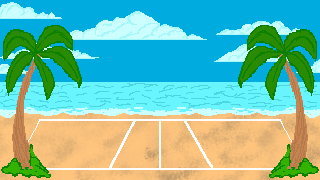

# jer-volleyclash-sunsetarcade
Práctica para la asignatura de **Juegos en Red (URJC)**. Curso 2025-2026.

---

# 7. Imagen y Diseño Visual

## 7.1 Estilo visual
El estilo visual del juego es **pixel art**, debido al nombre de nuestro equipo *Sunset Arcade*, representado con una máquina arcade retro.  
Por ello, todo el juego está diseñado en pixel art para aportarle esa apariencia nostálgica y retro.

## 7.2 Uso de colores
Se ha utilizado una **gama de colores llamativos y cálidos** para atraer la atención de los jugadores.

## 7.3 Logotipo
El logotipo elegido es un **balón de voleibol en llamas**, que refleja la intensidad y la competencia entre los jugadores.  

---

## 7.4 Bocetos

### 7.4.1 Interfaz
Se han realizado bocetos de distintas interfaces para ofrecer al usuario una experiencia **fácil, agradable e intuitiva** al jugar.  
Para ello, se han creado las siguientes pantallas: **menú inicial**, **configuración**, **créditos**, **modo de juego**, **personalización de personaje**, **selección de escenario**, **pantalla de juego** y **fin de partida**.

#### Menú inicial
En esta interfaz, el jugador podrá **comenzar una partida**, acceder a la **pantalla de configuración** o a los **créditos** del juego.  

#### Configuración
En esta pantalla, el jugador puede **cambiar el volumen del sonido** del juego y **modificar los controles** de la partida.  
Además, en el modo de juego se añadirá un botón para **abandonar la partida**.  

  

#### Créditos
En esta interfaz se incluirán **únicamente los miembros del equipo y sus tareas**, con la opción de volver a la pantalla de inicio.  

#### Modo de juego
En esta pantalla se presentan dos botones para elegir entre los modos de **juego local o en red**, según prefiera el jugador.  

#### Personalizar personaje del jugador
En esta interfaz, el jugador podrá **elegir su nombre, el color de la equipación y el personaje** que desee utilizar.  

#### Selección de escenario
En esta pantalla, el jugador podrá **elegir el escenario** en el que desea jugar la partida.  

#### Pantalla de juego
  

En la pantalla de juego se pueden encontrar los siguientes elementos:
- Contador de puntos (uno para cada jugador, ubicado en su lado del campo)
- Power-ups atrapados en el campo de cada jugador
- Tiempo restante de la partida
- Botón de configuración

#### Fin de partida
  

En esta interfaz aparecerá el **nombre del jugador ganador**.  
Además, habrá dos botones: uno para **buscar una nueva partida** y otro para **volver al menú inicial**.

---

### 7.4.2 Personajes

---

### 7.4.3 Escenarios
Para los escenarios, se han recreado **lugares típicos donde se suelen desarrollar los partidos de voleibol**.

#### Gimnasio

#### Playa

#### Patio trasero

---

### 7.4.4 Elementos del juego

#### Power-ups
        

#### Pelotas de voleibol
   

 
